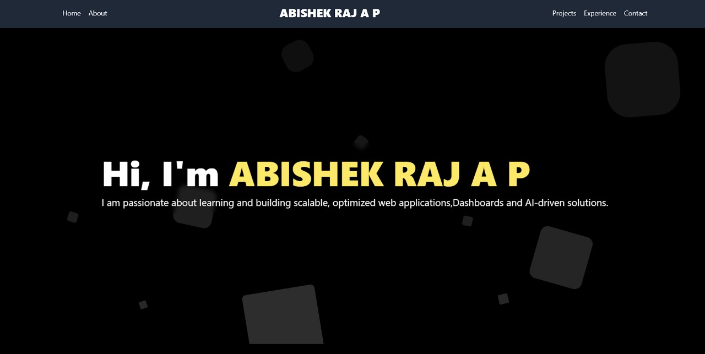
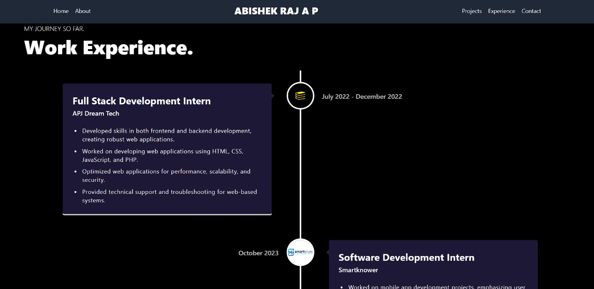

# Abishek Raj A P's Portfolio

This repository contains the source code for Abishek Raj A P's portfolio website. The portfolio showcases my skills, experiences, and projects in the field of software development and data analytics.


## Table of Contents
- [About](#about)
- [Features](#features)
- [Installation](#installation)
- [Usage](#usage)
- [Technologies Used](#technologies-used)

## About

This portfolio website is designed to provide an overview of my professional journey, including:
- Detailed descriptions of my internships and projects.
- Skills and technologies I have mastered.
- Links to my professional profiles and contact information.

## Features

- Dynamic display of services and experiences.
- Detailed sections for each internship and project.
- Contact form integrated with EmailJS for direct communication.

## Installation

To run this project locally, follow these steps:

1. **Clone the repository:**

   ```sh
   git clonehttps://github.com/ABISHEKBALANCE/portfolio-V2.git
Navigate to the project directory:


cd Portfolio-V2
Install the dependencies:

  ```
npm install
 ```
Usage
To start the development server:
 ```
npm start
 ```
The application will run on http://localhost:3000.

Building for Production
To create a production build, run:

 ```
npm run build
 ```
This will generate optimized static files in the build directory, ready to be deployed.

Technologies Used
React: JavaScript library for building user interfaces.
EmailJS: Service for sending emails directly from the client-side.
Node.js: JavaScript runtime for server-side development.
HTML5 & CSS3: Markup and styling for the web pages.
JavaScript: Programming language for implementing functionality.
Contact
Feel free to reach out to me through any of the following platforms:


License
This project is licensed under the MIT License. See the LICENSE file for details.
